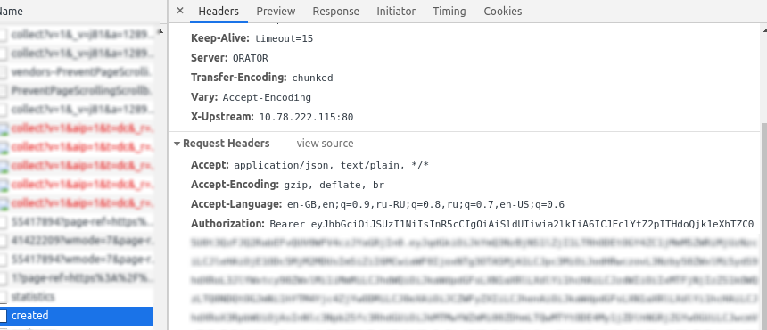

# Робот торговли на бирже Tele2

## Установка зависимостей: `pip3 install -r requirements.txt`

## Запуск

### Вариант 1: с помощью токена

Потребуется токен с сайта [Биржи Tele2](https://msk.tele2.ru/stock-exchange/my).

Для этого необходимо перейти по ссылке, нажать `F12` в браузере и во вкладке `Network`



Токеном будет являтсья все после `Authorization: Bearer `.

При запуске предложено будет выбрать вариант атворизации:
```bash
cd app/
python3 trade.py 
Auth trough token [1] or sms [2]:
```

При выборе `варианта 1` можно будет внести номер телефона и токен вручную.

Для упрощения можно сначала внести номер телефона и токен, а затем - запутстить скрипт:

```bash
cd app/
export default_phone=79012345678 
export default_token=iMmMiLCJhdWQ... #ваш токен
python3 trade.py 
```
Тогда можно при запросе номера телефона и токена можно будет оставить значения пустыми.

### Вариант 2: с помощью sms-сообщения

При запуске можно будет выбрать вариант с получением sms-сообщения:
```bash
cd app/
python3 trade.py 
Auth trough token [1] or sms [2]:
```

После этого будет необходимо будет ввести номера телефона и код из смс. В этом случае токен будет получен скриптом автоматически:
```bash
Your phone number: 79012345678
Sending sms to your phone..
Status code:  200
Type your sms code: XXXXXX
Tying to authenthicate..
Done!
```
Будет выведен токен (для возможности дальнейшего переиспользования) и запустится основная часть скрипта.


## Основные действия, выполняемые скриптом

```json
# какими пакетами продавать
price = {'voice': {'volume': 50}, 'data': {'volume': 1}}
# сколько пакетов продавать за раз
count = 7
```
Настройте значения на свое усмотрение: `volume` - это объем пакета для голоса и для интернета соответственно.

`count` - объем лотов, выставляемых за раз.

После запуска скрипта удаляются все установленные ранее лоты. После этого происходит установка лотов в соовтетсвтвии с устанвленными параметами.


