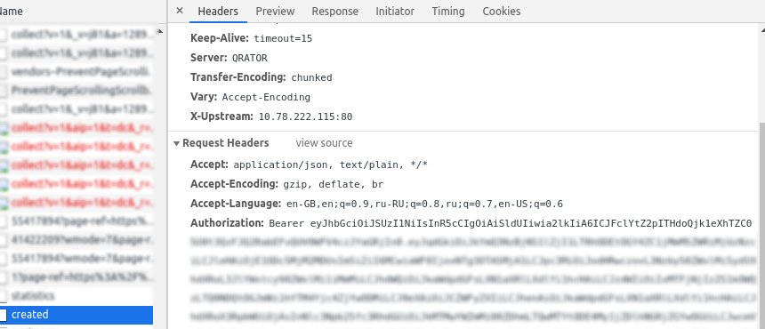

# Робот торговли на бирже Tele2

Бот автоматизирует продажу пакетов (голосовые минуты, гигабайты, SMS) на
[Бирже Tele2](https://msk.tele2.ru/stock-exchange/my).

Это современная переработка старой кодовой базы: пакетная структура `src/`,
dataclass-конфигурация, типизация, исключения вместо `exit()`, HTTP-транспорт
вынесен в отдельный клиент, добавлены тесты, Dockerfile и CI.

## Установка

```bash
pip install -e ".[dev]"
```

## Запуск

Потребуется токен с сайта [Биржи Tele2](https://msk.tele2.ru/stock-exchange/my).

Для этого необходимо перейти по ссылке, нажать `F12` в браузере и во вкладке `Network`.



Токеном будет являться всё после `Authorization: Bearer `.

Затем экспортируйте переменные окружения и запустите бота:

```bash
export DEFAULT_PHONE=79012345678
export DEFAULT_TOKEN=iMmMiLCJhdWQ... # ваш токен
tele2-trade           # или: python -m tele2_trade
```

Включите нужные типы лотов и настройте их параметры (значения по умолчанию):

| Переменная | По умолчанию | Описание |
| --- | --- | --- |
| `DEFAULT_PHONE` | — | Номер телефона (обязательно) |
| `DEFAULT_TOKEN` | — | Токен биржи (обязательно) |
| `DEBUG` | `false` | Подробное логирование |
| `VOICE_ENABLED` | `false` | Продавать голосовые минуты |
| `DATA_ENABLED` | `false` | Продавать гигабайты |
| `SMS_ENABLED` | `false` | Продавать SMS |
| `VOICE_VOLUME` | `50` | Объём пакета голосовых, мин |
| `DATA_VOLUME` | `1` | Объём пакета данных, ГБ |
| `SMS_VOLUME` | `50` | Объём пакета SMS |
| `VOICE_COUNT` | `3` | Кол-во выставляемых пакетов |
| `DATA_COUNT` | `3` | Кол-во выставляемых пакетов |
| `SMS_COUNT` | `1` | Кол-во выставляемых пакетов |
| `VOICE_MULTIPLIER` | `0.8` | Множитель цены |
| `DATA_MULTIPLIER` | `15.0` | Множитель цены |
| `SMS_MULTIPLIER` | `0.5` | Множитель цены |
| `MIN_WAIT_SECONDS` | `80` | Нижняя граница паузы между циклами |
| `MAX_WAIT_SECONDS` | `120` | Верхняя граница паузы между циклами |

### Анализатор рынка

```bash
tele2-analyzer          # или: python -m tele2_trade.analyze
```

### Запуск в Docker

```bash
docker build -t tele2-trade .
docker run --rm \
  -e DEFAULT_PHONE=79012345678 \
  -e DEFAULT_TOKEN=tok \
  -e VOICE_ENABLED=true \
  tele2-trade
```

## Что делает бот

Скрипт удаляет все установленные ранее лоты и выставляет заново указанное их
количество в соответствии с параметрами. При ошибке выбранный тип лотов
отключается, и работа продолжается с оставшимися типами. После того как все
типы обработаны, бот завершает работу.

## Разработка

```bash
pip install -e ".[dev]"
pytest
```

Тесты запускаются автоматически в CI при создании merge request
(см. `.github/workflows/ci.yml`).

## TODO

- Полноценная работа с БД (история продаж, выбор токена из сохранённых)
- Уведомления о продажах
- Осознанная обработка дневного лимита